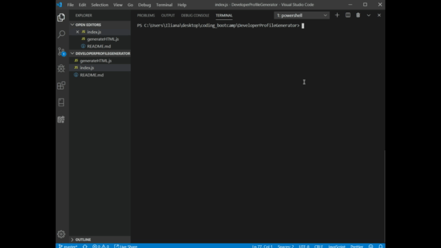
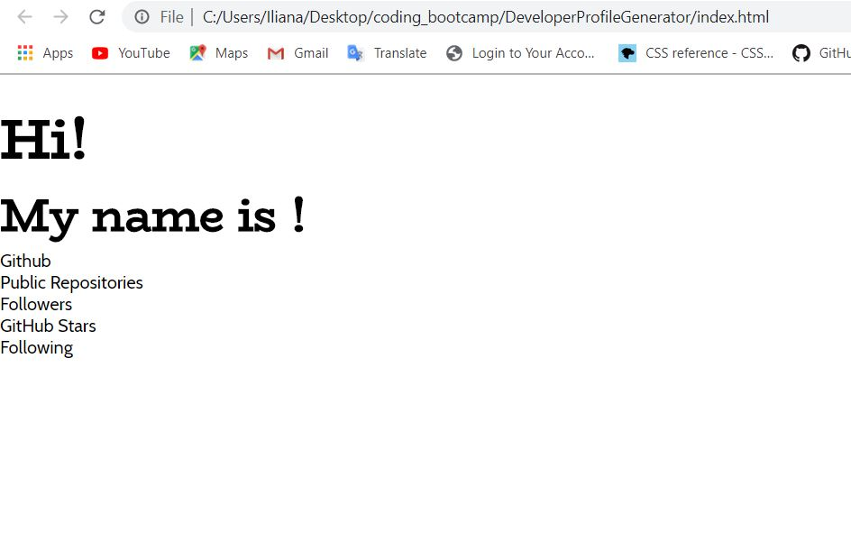

# ProfileGenerator
* In process project to create a PDF from an HTML page generated with javascript.
* The information being pulled is from a users GitHub page.
* Gif of terminal in action and generation of HTML

* Screenshot of what is currently generated from index.js.

*While this is nothing what the end result should look like, with some more tweaking I can get it to look like the assignment. 